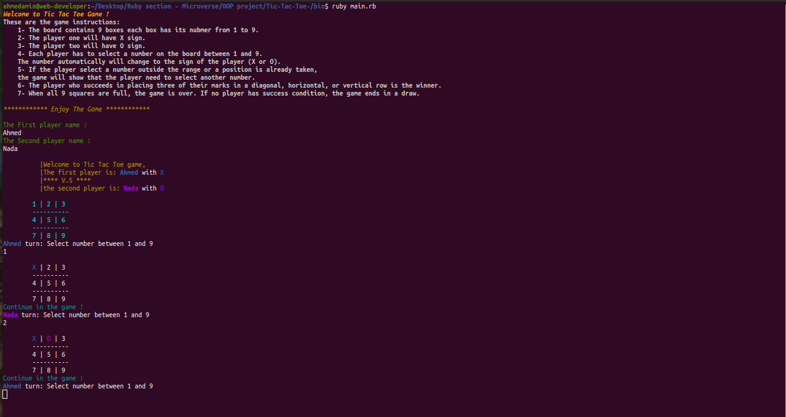

# Tic-Tac-Toe

In this project I created a Tic Tac Toe game using Ruby.

# Built with:
* Ruby.
* Rainbow gem


# Game Rules: 

1. The game is played on a grid that's 3 squares by 3 squares.

2. One of the player is X and the second player is O. Players take turns putting their marks in the squares.

3. The player who succeeds in placing three of their marks in a diagonal, horizontal, or vertical row is the winner.

4. When all 9 squares are full, the game is over. If no player has 3 marks in a row, the game ends in a draw.

# The game instructions:

These are the game instructions:
1. The board contains 9 boxes each box has its nubmer from 1 to 9.
2. The player one will have X sign.
3. The player two will have O sign.
4. Each player has to select a number on the board between 1 and 9. The number automatically will change to the sign of the player (X or O).
5. If the player select a number outside the range or a position is already taken, the game will show that the player need to select another number.
6. The player who succeeds in placing three of their marks in a diagonal, horizontal, or vertical row is the winner.
7. When all 9 squares are full, the game is over. If no player has success condition, the game ends in a draw.


# Setup:

1. To run this project locally, please ensure you have Ruby installed on your machine, then clone this repository by running.

```bash
git clone https://github.com/Wusinho/Tic-Tac-Toe
```
2. After cloning open the file and go to bin directory then open the terminal and write in terminal :

```bash 
 ruby main.rb
```
3. Maximize your terminal window for a better experience. 

4. Enjoy the game!

# The game screenshot :


# Live preview :

[Live Demo Link](https://repl.it/@AhmedAmin3/Tic-Tac-Toe-Game)


# Author:

👤  Ahmed Amin

- Github: [@AhmedAmin90](https://github.com/AhmedAmin90)
- Twitter: [@AhmedAmin12383](https://twitter.com/AhmedAmin12383)
- LinkedIn: [AhmedAmin](https://www.linkedin.com/in/web-developer)

## Show your support

Give a ⭐️ if you like this project!

## Acknowledgments

- Microverse


## 📝 License

This project is [MIT](LICENSE) licensed.
